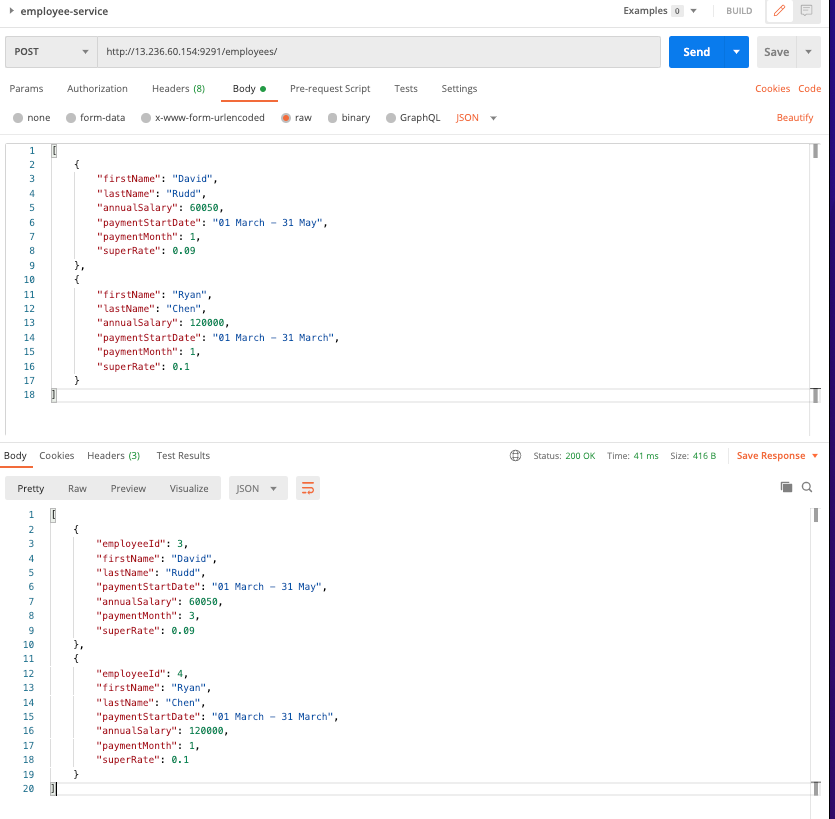
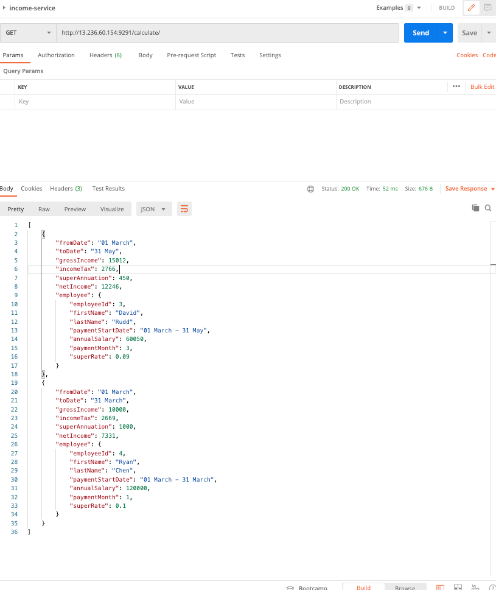
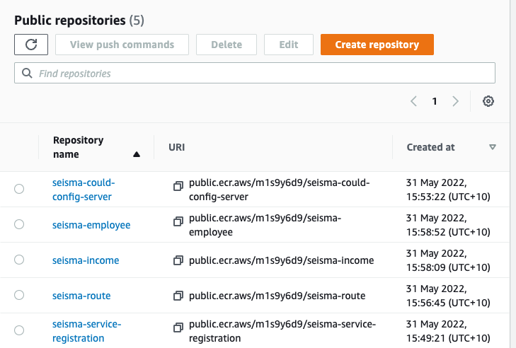
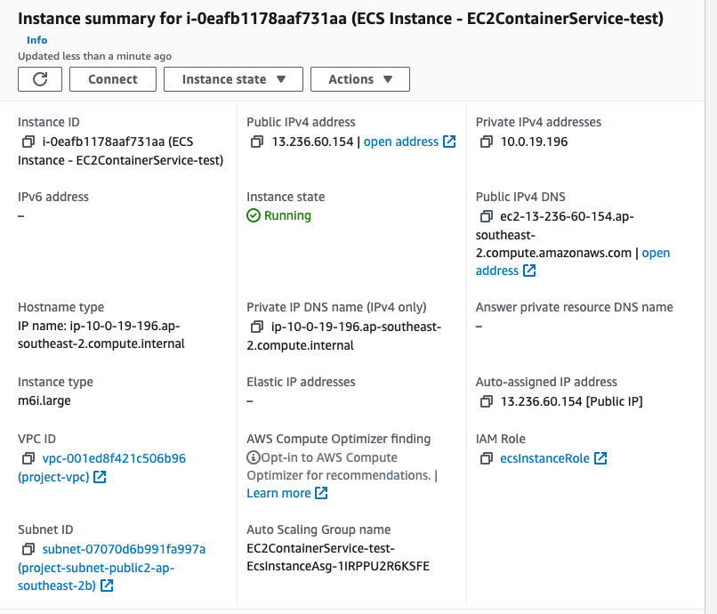
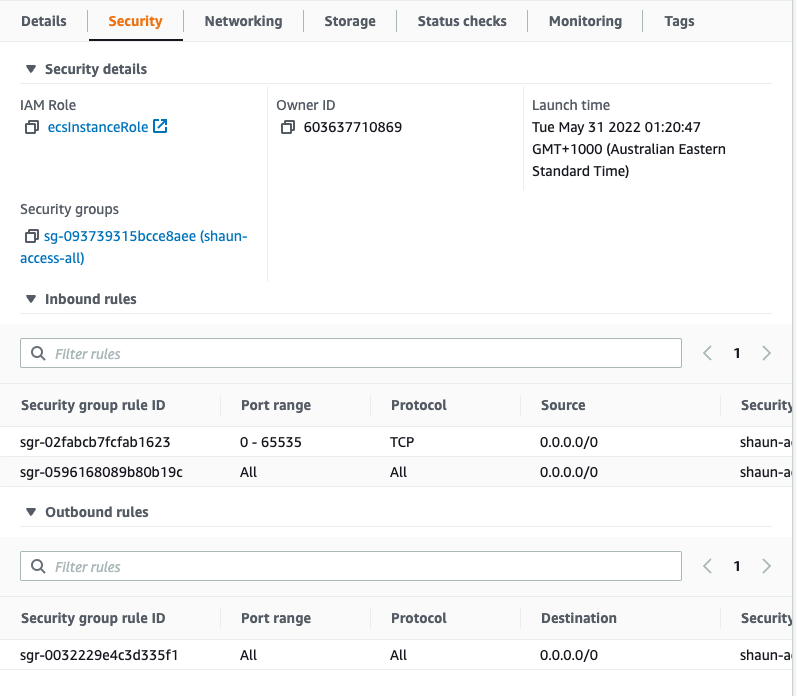
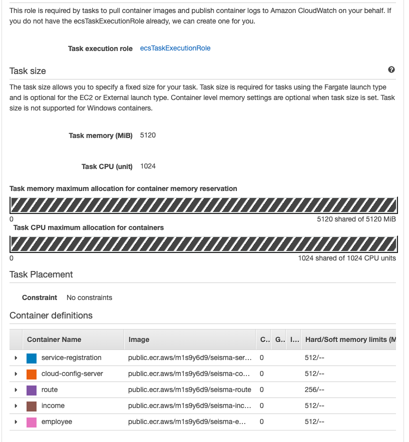
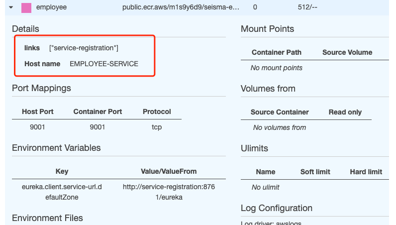

# Seisma TechTest
### Author: Shaun
### Date: 31/05/2022

## Github repository: https://github.com/sshaunn/spring-boot-services
## Simple Introduction
This is a spring micro services app is pure backend application (without any frontend UI/UX).
I have couple years not using java and its framework, so I need to simply back to review
everything.
+ First micro service is spring eureka server which is service registration,
and will discover all registered eureka clients.
+ Second service is cloud config server, which can back up the server configuration
in the github. Clone the configuration file (application.yml) from github link every single
time when this application start running.
+ Third service is API gateway, which map all services port number and arrange all
http request coming in, so you do not need to change each service port number.
+ Forth service is Employee, which is entity class service, can CRUD all employees
personal information such as name, income etc...
+ Last service is Income, this service is the way to calculate all employees income
and tax and super.

## Running instruction

### Here are 2 ways to test this rest api application.
+ Step 1: You need a http tool such as Postman.

#### If you want to run at local machine, command line here:
```
Step 1: git clone https://github.com/sshaunn/spring-boot-services.git
Step 2: docker compose up
```
#### Or if you want to run at cloud server, here are 3 given apis:
+ POST method: http://13.236.60.154:9291/employees/
+ DELETE method: http://13.236.60.154:9291/employees/delete
+ GET method: http://13.236.60.154:9291/calculate/

### Request payload format example:
So in the Post method api, you should follow this request body format,
Note the request body must be in JSON style (contentType = MediaType.Application_JSON)

```
[
    {
        "firstName": "David",
        "lastName": "Rudd",
        "annualSalary": 60050,
        "paymentStartDate": "01 March - 31 May",
        "paymentMonth": 1,
        "superRate": 0.09
    },
    {
        "firstName": "Ryan",
        "lastName": "Chen",
        "annualSalary": 120000,
        "paymentStartDate": "01 March - 31 March",
        "paymentMonth": 1,
        "superRate": 0.1
    }
]
```

### Response body format:
In the GET method, there is a logic to calculate the all employee income includes
gross income, net income, and super annually.

```
[
    {
        "fromDate": "01 March",
        "toDate": "31 May",
        "grossIncome": 15012,
        "incomeTax": 2766,
        "superAnnuation": 450,
        "netIncome": 12246,
        "employee": {
            "employeeId": 3,
            "firstName": "David",
            "lastName": "Rudd",
            "paymentStartDate": "01 March - 31 May",
            "annualSalary": 60050,
            "paymentMonth": 3,
            "superRate": 0.09
        }
    },
    {
        "fromDate": "01 March",
        "toDate": "31 March",
        "grossIncome": 10000,
        "incomeTax": 2669,
        "superAnnuation": 1000,
        "netIncome": 7331,
        "employee": {
            "employeeId": 4,
            "firstName": "Ryan",
            "lastName": "Chen",
            "paymentStartDate": "01 March - 31 March",
            "annualSalary": 120000,
            "paymentMonth": 1,
            "superRate": 0.1
        }
    }
]
```
### Basic logic
+ Simply validate the data from request, and check the number if it is less than 0,
handle this exception.
+ Save employees data into local h2 database, and internally send the employees data 
to income service, to calculate all data which is needed to process.

### Docker images and containers
+ Step 1: Each service has its own Dockerfile.
```
mvn clean package

docker build -t [service name] .
```
+ Step 2: Wrap all images into docker compose, you can find docker-compose.yml file
```
version: '3.8'
#x-aws-vpc: "vpc-001ed8f421c506b96"
services:
  service-registration:
#    image: public.ecr.aws/m1s9y6d9/service-registration:latest
    container_name: service-registration
    build:
      context: ./service-registration
      dockerfile: Dockerfile
    ports:
      - "8761:8761"
#    x-aws-protocol: http
  cloud-config-server:
#    image: public.ecr.aws/m1s9y6d9/cloud-config-server:latest
    container_name: cloud-config-server
    build:
      context: ./cloud-config-server
      dockerfile: Dockerfile
    environment:
      - eureka.client.service-url.defaultZone=http://service-registration:8761/eureka
    depends_on:
      - service-registration
    ports:
      - "9191:9191"
#    x-aws-protocol: http
  route:
#    image: public.ecr.aws/m1s9y6d9/route:latest
    container_name: route
    build:
      context: ./route
      dockerfile: Dockerfile
    environment:
      - eureka.client.service-url.defaultZone=http://service-registration:8761/eureka
    depends_on:
      - service-registration
      - employee
      - income
    ports:
      - "9291:9291"
#    x-aws-protocol: http
  employee:
#    image: public.ecr.aws/m1s9y6d9/employee:latest
    container_name: employee
    build:
      context: ./employee
      dockerfile: Dockerfile
    environment:
      - eureka.client.service-url.defaultZone=http://service-registration:8761/eureka
    depends_on:
      - service-registration
    ports:
      - "9001:9001"
#    x-aws-protocol: http
  income:
#    image: public.ecr.aws/m1s9y6d9/income:latest
    container_name: income
    build:
      context: ./income
      dockerfile: Dockerfile
    environment:
      - eureka.client.service-url.defaultZone=http://service-registration:8761/eureka
    depends_on:
      - service-registration
    ports:
      - "9002:9002"
#    x-aws-protocol: http
```
+ Step 3: Push all images to AWS ECR:
```
docker tag [service]:[tag] public.ecr.aws/[repository]/[service]:[tag]
docker push public.ecr.aws/[repository]/[service]:[tag]

e.g:
docker tag seisma-employee:latest public.ecr.aws/m1s9y6d9/seisma-employee:latest
docker push public.ecr.aws/m1s9y6d9/seisma-employee:latest
```
### AWS ECS Configuration

+ Step 1: Push all local docker images to cloud AWS ECR repository.

+ Step 2: Create EC2 instance, and security group.
Note: Set up All tcp & All traffic here.


+ Create ECS Cluster and then get into Task Definitions to set up all containers.
In this step, you NEED to set up all containers link to eureka server (service-registration),
Make sure your API gateway must link to http services component (Income and Employee in this app),
and if any services has internal RestTemplate request, you also need to set up hostname otherwise
the another service is not able to connect to it. For example here, container 'employee' has hostname
called 'EMPLOYEE-SERVICE', so when http request goes to income service, it can get
employees data from container 'employee'.



### File Structure
```　　
├─Seisma
│  │─service-registration
│  │  │─src
│  │  │ └─main
│  │  │     │─java
│  │  │     │   └─com.dev.serviceregistration
│  │  │     │       └─ServiceRegistrationApplication.java
│  │  │     │─resources
│  │  │     │   ├─application.yml
│  │  │     │   └─bootstrap.yml
│  │  │─Dockerfile 
│  │  │─pom.xml
│  │─cloud-config-server
│  │  │─src
│  │  │ └─main
│  │  │     │─java
│  │  │     │   └─com.dev.cloudconfigserver
│  │  │     │       └─CloudConfigServerApplication.java
│  │  │     │─resources
│  │  │     │   ├─application.yml
│  │  │─Dockerfile 
│  │  │─pom.xml
│  │─route
│  │  │─src
│  │  │ └─main
│  │  │     │─java
│  │  │     │   └─com.dev.route
│  │  │     │       └─RouteApplication.java
│  │  │     │─resources
│  │  │     │   ├─application.yml
│  │  │─Dockerfile 
│  │  │─pom.xml
│  │─income
│  │  │─src
│  │  │ └─main
│  │  │     │─java
│  │  │     │   └─com.dev.income
│  │  │     │       │─controller
│  │  │     │       │  └─IncomeController.java
│  │  │     │       │─exception
│  │  │     │       │  └─EmployeeNotFoundException.java
│  │  │     │       │─model
│  │  │     │       │  └─Income.java
│  │  │     │       │─orm
│  │  │     │       │  └─Employee.java
│  │  │     │       │─service
│  │  │     │       │  └─IncomeService.java
│  │  │     │       └─IncomeApplication.java
│  │  │     │─resources
│  │  │     │   ├─application.yml
│  │  │─Dockerfile 
│  │  │─pom.xml
│  │─employee
│     └─src
│      └─main
│          └─java
│              └─com.dev.employee
│                  │─controller
│                  │  └─EmployeeController.java
│                  │─exception
│                  │  └─EmployeeNotFoundException.java
│                  │─model
│                  │  └─Employee.java
│                  │─service
│                  │  └─EmployeeService.java
│                  └─IncomeApplication.java
│          └─resources
│              └─application.yml
│     │─Dockerfile 
│     └─pom.xml
└─docker-compose.yml
```